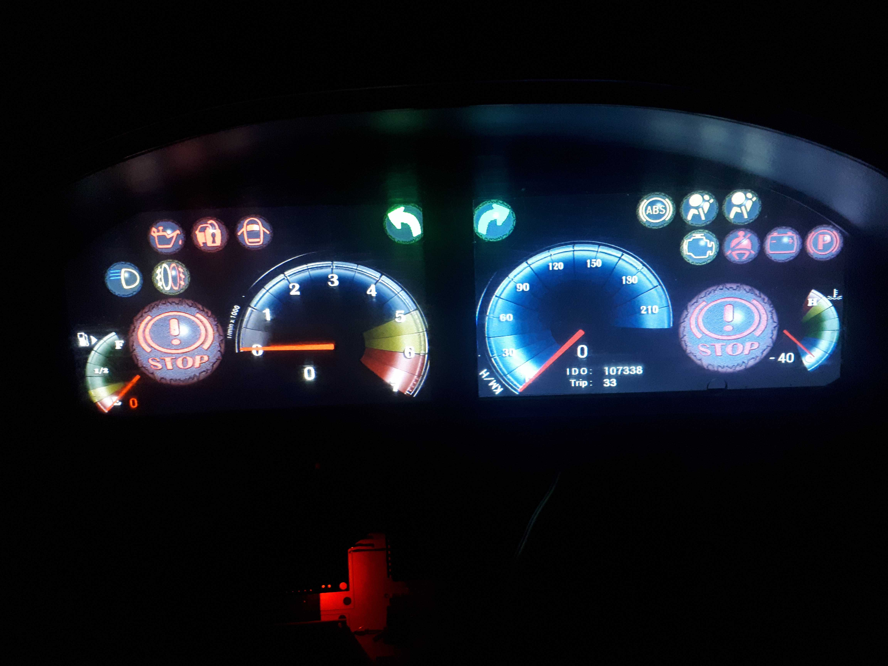

# Automotive Digital Instrument Cluster  
**AVR / ARM – FT810 – Real Vehicle Deployment**

## Overview
This project is a **fully functional digital automotive instrument cluster**
designed and implemented as a **real replacement** for the factory analog cluster
used in **Peugeot 405 / Peugeot Pars** vehicles.

The system replaces the original dashboard with **two 7" TFT LCDs** driven by
**FT810 graphics controllers**, initially controlled by an **ATmega128** and later
successfully **ported to an ARM LPC1768 platform** to improve performance,
scalability, and accuracy.

This is not a simulation or demo project — the system was **installed, tested,
and operated in a real vehicle under real automotive conditions**.

---

## Key Features
- Dual 7" TFT LCDs (AT070TN92) driven by **FT810 (x2)**
- Accurate **speed and RPM measurement** using hardware input capture
- **Fuel level and engine temperature** measurement via ADC
- Robust **non-volatile storage** for odometer and trip data
- Automotive-grade **signal conditioning** for:
  - Ignition noise
  - Voltage spikes during engine start
  - Mixed digital / analog automotive signals
- **Custom-designed PCB** (Altium Designer)
- **Custom UI/UX graphics** (3ds Max & Photoshop)
- Fully bare-metal embedded implementation (no OS)

---

## Hardware Architecture
- **Microcontrollers**
  - ATmega128 (initial implementation)
  - LPC1768 (ARM Cortex-M3, migrated version)
- **Display Controllers**
  - FT810 (x2) over SPI
- **Power Supply**
  - LM2576 buck converter
  - XL6009 boost converter
  - Custom negative voltage generation for TFT panels
- **Automotive Interfaces**
  - Transistor-based signal isolation
  - Zener-based voltage protection
  - EMI and transient suppression

---

## Software Architecture
- Bare-metal **C**
- Hardware drivers:
  - Timers
  - ADC
  - Input Capture
  - SPI
- Custom FT810 display driver
- Non-volatile data handling
- Modular, maintainable firmware structure

---

## Development Scope
- Electronics design and PCB layout
- Embedded firmware development
- Automotive signal analysis and conditioning
- UI design and graphics generation
- Real-world debugging and validation inside a vehicle

All hardware, firmware, and graphics were designed and implemented **independently**.

---

## Status
**Completed and deployed**  
Successfully tested in real driving conditions.

## Media

### Installed in Vehicle
Real-world installation of the digital instrument cluster
inside a Peugeot vehicle, replacing the factory dashboard.but because of cars shakes they have low quality!
ذعف 

### UI Test & Development
Standalone UI testing during development phase.

